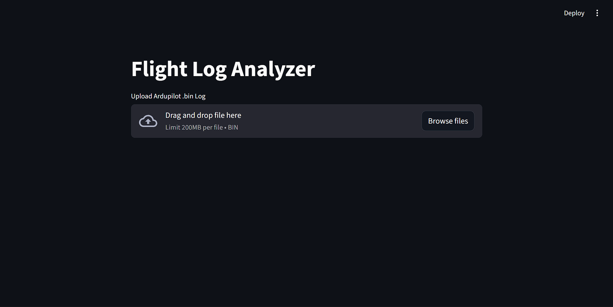
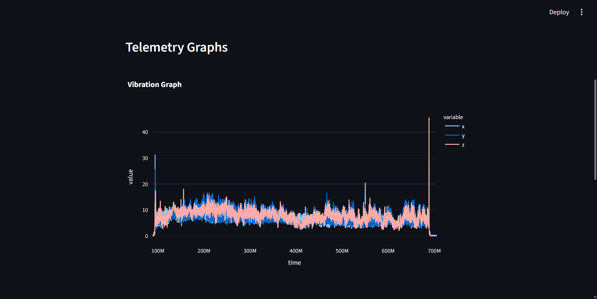
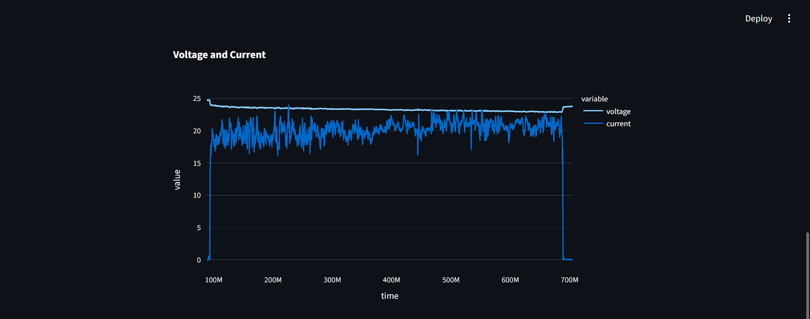
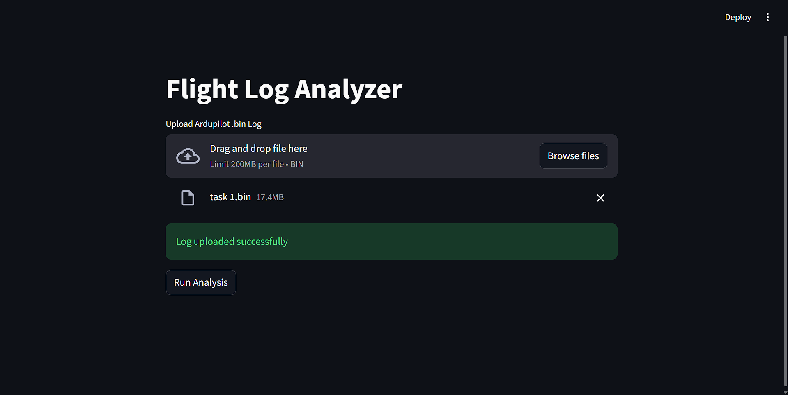
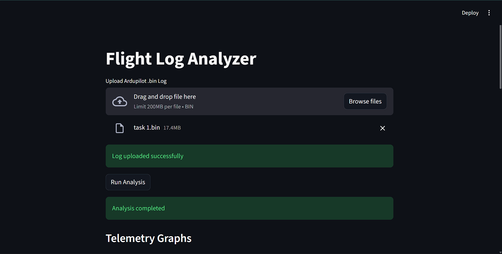

# Flight Log Analyzer

[](https://opensource.org/licenses/MIT)
[](https://www.python.org/)

A simple, user-friendly Streamlit web app for parsing and analyzing ArduPilot `.bin` flight logs. Extract telemetry data (vibration, battery, GPS, flight modes), generate interactive graphs, and export downloadable Excel reports for drone performance insights.



## Table of Contents
- [Features](#features)
- [Screenshots](#screenshots)
- [Prerequisites](#prerequisites)
- [Installation](#installation)
- [Usage](#usage)
- [Output](#output)
- [Contributing](#contributing)
- [License](#license)
- [Contact](#contact)

## Features
- **Log Parsing**: Reads ArduPilot `.bin` files using `pymavlink` for accurate telemetry extraction.
- **Data Extraction**: Pulls key metrics like vibration, battery voltage/current, GPS coordinates, and flight modes.
- **Interactive Graphs**: Visualizes data with Plotly charts in the browser.
- **Excel Export**: Generates multi-sheet Excel reports via pandas and openpyxl.
- **Web UI**: Simple Streamlit interface for uploading logs and running analysis.

## Screenshots
### Home Screen


### Vibration and Power Graphs



### Upload and Analysis



### Download Report


## Prerequisites
- **Python**: 3.8 or higher
- **ArduPilot Log File**: A valid `.bin` log from an ArduPilot-based drone
- **Browser**: Modern web browser for the Streamlit UI

## 🚀 Installation & Quick Start

1. **Clone the repository**:
   ```bash
   git clone https://github.com/bldxspark/flight_log_analyzer.git
   cd flight_log_analyzer
   ```

2. **Create and activate a virtual environment**:
   - **Windows (PowerShell)**:
   ```powershell
   python -m venv .venv
   .\.venv\Scripts\Activate.ps1
   ```
   - **macOS/Linux**:
   ```bash
   python3 -m venv .venv
   source .venv/bin/activate
   ```

3. **Install required packages**:
   ```bash
   pip install -r requirements.txt
   ```

4. **Run the app**:
   ```bash
   python -m streamlit run app.py
   ```

## 📁 Output
- Generated reports are saved under `flight_reports/report_<n>/excel/flight_data.xlsx`
- Uploaded logs are stored in `logs/`

## 📝 Notes
- `.venv/`, `logs/`, `flight_reports/` and Python bytecode are ignored via `.gitignore`.

## 🤝 Contributing
Contributions are welcome! Please feel free to submit a Pull Request.

## 📧 Contact
Your Name - your.email@example.com

Project Link: https://github.com/bldxspark/flight_log_analyzer
